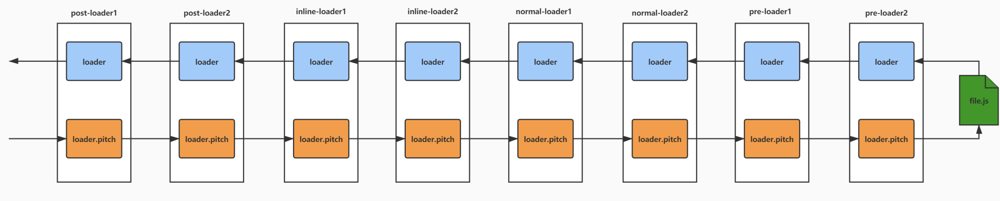

### loader
#### loader的功能以及作用。
* loader用来处理资源，将资源转换成js能识别的文本。通常返回一个文本，这个文本可以用module.exports进行导出一些给到的文本。
```
  // 比如style-loader,当我们require一个css文件时候。我们需要做的只是将接收到的css内容放到style标签中并且插入html中。
  function styleLoader(source) {
    var script = `
    let style = document.createElement("style");
      style.innerHTML = ${JSON.stringify(source)};
    document.head.appendChild(style);
    module.exports = "";
    `
  }
```
#### loader的分类(通过loader的执行顺序分类)
1. inline-loader写在require代码中的，用！分隔各个loader，最后为资源。
2. post-loader,定义在module.rules中的通过enforce:post来定义。
3. normal-loader,定义在module.rules中，默认就是normal-loader。
4. pre-loader，定义在module.rules中，通过enforece:pre来定义。
```
  module: {
    rules: [{
      test: /\.js$/,
      use: [
        {
          loader: 'log-loader',
          enforce: 'pre'
        },
        {
          loader: 'babel-loader',
          enforce: 'post'
        }
      ]
    }]
  }
```
#### loader函数中的pitch
* loader中的pitch是一个函数，如果有返回值，那么laoder就会中断执行流程。找到preLoader执行他们的普通流程。

#### loader处理函数的实现流程
1. 拿到需要处理资源的路径作为resource。
2. 将匹配资源的loader根据类型进行组装[post-loader, inline-loader, normal-loader, pre-loader]组装成laoder数组。
```
  let fs = require('fs')
  let resource = path.resolve(__dirname, 'src', 'main.js')
  let rules = module.rules
  let preLoaders = []
  let normalLoaders = []
  let postLoaders = []
  let loaders = []
  for (let rulse of rules) {
    if (rule.test.test(resource)) {
      if (rule.enforce === 'pre') {
        preLoaders = [...preLoaders, ...rule.use]
      } else if(rule.enforce === 'post') {
        postLoaders = [...postLoaders, ...rule.use]
      } else {
        normalLoaders = [...normalLoaders, ...rule.use]
      }
    }
  }
  loaders = [...postLoaders, ...normalLoaders, ...preLoaders]
  runLoaders({
    resouce,
    loaders,
    context: {},
    readResource: fs.readFile.bind(fs)
  })
```
3. 这个时候我们拿到了需要处理的资源resource和已经整理好的laoders，那么接下来我们执行runLoaders来用各个loader处理资源。
* 目标1，让各个loader处理资源并且传递到下一个loader继续处理。
* 目标2，loader函数中可以通过this执行一些我们定义好的方法，比如this.async()异步执行，this.callback()执行下个loader
4. 构建每个loader的上下文对象，让loader函数可以通过this来调用一些提供的方法
```
runLoaders({resource, loaders, context, readSource}) {
  let loaderContext = context
  loaderContext.resource = resource
  loaderContext.loaders
  loaderContext.callback = null
  loaderContext.async = false // loader的执行是否是异步的
  loaderContext.loaderIndex = 0 // 定义当前执行的是哪个loader
  loaderContext.readSource = readSource
  let processOptions = {
    resourceBuffer: null
  }
  processResource(processOptions, loaderContext, () => {
    console.log('执行完成')
  })
}
```
4. (*): 这里需要单独对loaders做一些处理，将loader的具体内容拿到，并且定义loader的raw(是否需要buffer)，normal(loader的定义), pitch(loader中的pitch函数)方便以后调用。
```
  loaderContext.loaders = loaders.map(createLoader)
  function createLoader(loader) {
    let obj = {
      request: loader,
      pitchExecuted: false, // 是否已经执行过pitch方法
      normalExecuted: false // 是否已经执行过loader。
    }
    obj.normal = require(loader)
    obj.raw = obj.normal.raw
    obj.pitch = obj.normal.pitch
    return obj
  }
```
5. 拿到资源的具体内容然后顺序调用loaders中的数组(此处省略了pitch的过程，此过程和normal过程类似)
```
  function processResource(processOptions, loaderContext, callbak) {
    loaderContext.loaderIndex = loaderContext.loaders.length - 1;
    loaderContext.readResource(loaderContext.resource, function(err, buf) {
      processOptions.resourceBuffer = buf
      iterateNormalLoaders(processOptions, loaderContext, callback)
    })
  }
```
6. 定义iterateNormalLoaders函数实现核心的loader调用逻辑。
```
  function iterateNormalLoaders(processOptions, loaderContext, callback) {
    if (loaderContext.loaderIndex <0) {
      callback(null, processOptions.resourceBuffer)
    }
    let curLoader = loaderContext.loaders[oaderContext.loaderIndex]
    if (curLoader.normalExecuted) {
      loaderContext.loaderIndex --
      return iterateNormalLoaders(processOptions, loaderContext, callback)
    }
    let fn = curLoader.normal
    curLoader.normalExecuted = true;
    if (!normal) {
      loaderContext.loaderIndex --
      return iterateNormalLoaders(processOptions, loaderContext, callback)
    }
    handleBuf(processOptions, curLoader)
    runSyncOrAsync(fn, processOptions, function(err) {
      if (err) {
        return  callback(err)
      }
      iterateNormalLoaders(processOptions, curLoader, loaderContext, callback)
    })
  }
```
7. 根据loader需要的资源类型来转换资源类型，当laoder中定义了raw=true的时候需要将资源转换为buffer，否则为字符串
```
  function handleBuf(processOptions, loader) {
    let resource = processOptions.resourceBuffer
    if (loader.raw && !Buffer.isBuffer(resource)) {
      processOptions.resourceBuffer = Buffer.from(resource)
    }
    if (!loader.raw && Buffer.isBuffer(resource)) {
      processOptions.resourceBuffer = resource.toString('utf-8')
    }
  }
```
8. 拿到laoder需要的资源类型以及loader的函数之后，开始正式执行loader。
* 1: 实现每个任务流水线式执行
* 2：实现loader中可以通过callback返回内容并且传递给下一个loader
* 3：实现loader中可以通过async()方法异步执行，在执行完毕之后通过this.callback方法传递参数给下一个loader。
```
  function runSyncOrAsync(processOptions, curLoader, loaderContext, callback) {
    let isSync = true
    let isDone = false
    loaderContext.callback = function(err, ...args) {
      isSync = false
      callback(err, args)
    }
    loaderContext.async = function() {
      isSync = false
      return loaderContext.callback
    }
    let result = curLoader.call(loaderContext, processOptions.resourceBuffer)
    if (!isResult) {
      callback(null, result)
    }
  }
```

