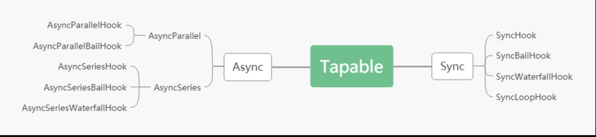

### tapable: 提供webpack中plugin的事件流的库。
#### 功能说明
* 通过tap|tapAsync|tapPromise来提供事件的注册功能
* 通过call|callAsync|promise来触发注册的事件
* 通过实例化hook时候指定参数，参数可以传入到注册事件的函数参数中。
#### hook的分类
* 根据同步异步执行方式，分为同步异步hook
* 根据事件执行功能分为：normal-hook，事件之间没关系，bail-hook，事件返回不为undefined则退出，waterFall-hook，上一次执行的结果会传递到下一个事件的入参。

#### SyncHook：同步hook
```
  const {SyncHook} = require('tapable')
  let hook = new SyncHook([name, age])
  hook.tap('test', function(name,age) {
    console.log(name,age)
  })
  hook.call('hjd', '28')
  hook.callPromise('hjd', 28, function() {console.log('success')})
  hook.promise('hjd', 28).then(() => {console.log('success)
```
#### SyncBailHook: 同步保险hook(有一个事件的返回值不为undefined则退出整个事件)
```
  let bailHook = new SyncBailHook(['aaa'])
  bailHook.tap('1', function(name) {
    console.log('1', name,)
    return 0
  })
  bailHook.tap('2', function(name) {
    console.log(2, name)
  })
  bailHook.call('888')
  bailHook.callAsync('555', function() {
    console.log('success')
  })
```
#### SyncWaterHook: 同步水流hook(每个事件返回的值如果不为undefined则会传递到下一个事件的第一个参数中)
```
let syncwater = new SyncWaterfallHook(['name', 'age'])
syncwater.tap('1', function(name,age) {
  console.log(1, name, age)
  return false
})
syncwater.tap('2', function(name, age) {
  console.log(2, name, age)
})
syncwater.call('hjd', 29)
syncwater.callAsync('test',26, function() {
  console.log('success')
})
syncwater.promise('hehe', 10).then(() => {
  console.log('ok')
})
```
### 异步串行钩子(绑定的事件可以是异步的或者同步的，异步的话通过done执行下一个事件)
```
  queue.tap('tap2', function(name) {
  console.log(name, 't2')
})

queue.tap('1', function(name) {
  console.log(name, 't1')
})
queue.tapAsync('1', function(name,done) {
  setTimeout(function() {
    console.log(1)
    done()
  }, 2000)
})
queue.tapAsync('2', function(name,done) {
  setTimeout(function() {
    console.log(2)
    done()
  }, 1000)
})
queue.tap('a', function(name) {
  console.log(name, 't3')
})
queue.callAsync('hjd',() => {
  console.log('async完成')
})
```
