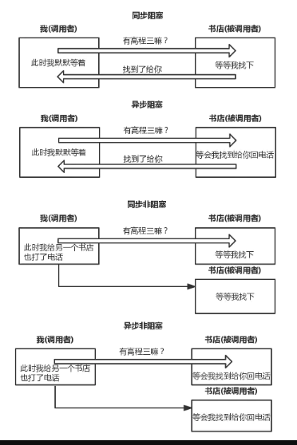

### nodejs概念
* 是一个基于chrome v8的js运行环境。
#### 特点
* 事件驱动
* 单进程： 系统中只有一个主线程接受请求
* 非阻塞式io
* 适用于高并发，i/o密集型场景。
### 单线程的与多线程的优劣对比。
#### 优点
1. 节约内存。
2. 避免了线程切换的消耗以及锁的问题。
3. 节约上下文切换花费的时间。
#### 缺点
1. 无法利用多核cpu。
2. 大型计算导致io到不到及时响应。
3. 代码出错，整个系统奔溃。
#### 进程和线程的概念
* 线程在进程下行进（单纯的车厢无法运行）
* 一个进程可以包含多个线程（一辆火车可以有多个车厢）
* 不同进程间数据很难共享（一辆火车上的乘客很难换到另外一辆火车，比如站点换乘）
* 同一进程下不同线程间数据很易共享（A车厢换到B车厢很容易）
* 进程要比线程消耗更多的计算机资源（采用多列火车相比多个车厢更耗资源）
* 进程间不会相互影响，一个线程挂掉将导致整个进程挂掉（一列火车不会影响到另外一列火车，但是如果一列火车上中间的一节车厢着火了，将影响到所有车厢）进程可以拓展到多机，进程最多适合多核（不同火车可以开在多个轨道上，同一火车的车厢不能在行进的不同的轨道上）
* 进程使用的内存地址可以上锁，即一个线程使用某些共享内存时，其他线程必须等它结束，才能使用这一块内存。（比如火车上的洗手间）－"互斥锁"
* 进程使用的内存地址可以限定使用量（比如火车上的餐厅，最多只允许多少人进入，如果满了需要在门口等，等有人出来了才能进去）－“信号量”
#### 阻塞和非阻塞的概念
* 阻塞和非阻塞是由调用方决定的，我请求某个资源，这个时候我的状态是阻塞的还是非阻塞的。
#### 同步异步
* 同步异步由被调用方决定，我请求某个资源，这个资源告诉我是让我等还是说先让我干其他的，等好了再通知我
