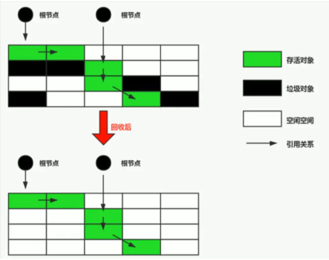

### 老生代内存
* 管理着大量的存活对象
* 如果依旧使用Scavenge算法的话，很明显会浪费一半的内存，因此已经不再使用Scavenge算法，而是采用新的算法
* 适用算法：Mark-Sweep(标记清除)和Mark-Compact(标记整理)
#### Mark-Sweep算法执行过程
* 标记：collector从根节点开始遍历，标记所有可到达被引用的对象，
* 清除：collector对堆内存从头到尾进行遍历，如果发现某个对象没有被标记，则将其回收。

#### Mark-Sweep算法的缺点
* 1. 历过一次标记清除后，内存空间可能会出现不连续的状态导致后面如果需要分配一个大对象而空闲内存不足以分配就会提前触发垃圾回收，而这次垃圾回收其实是没必要的
#### 标记整理(用于解决Mark-Sweep算法的缺点)
#### Mark-Compact标记整理的过程
1. 假设在老生代中有A、B、C、D四个对象
2. 在垃圾回收的标记阶段，将对象A和对象C标记为活动的
3. 在垃圾回收的整理阶段，将活动的对象往堆内存的一端移动
4. 在垃圾回收的清除阶段，将活动对象左侧的内存全部回收
#### Mark-Compact标记整理的缺点
至此就完成了一次老生代垃圾回收的全部过程，我们在前文中说过，由于JS的单线程机制，垃圾回收的过程会阻碍主线程同步任务的执行，待执行完垃圾回收后才会再次恢复执行主任务的逻辑，这种行为被称为全停顿(stop-the-world)。在标记阶段同样会阻碍主线程的执行，一般来说，老生代会保存大量存活的对象，如果在标记阶段将整个堆内存遍历一遍，那么势必会造成严重的卡顿。
* 基于这些问题又产生了增量标记，增量整理。让清理和整理的过程也变成增量式的。同时为了充分利用多核CPU的性能，也将引入并行标记和并行清理，进一步地减少垃圾回收对主线程的影响，为应用提升更多的性能。
