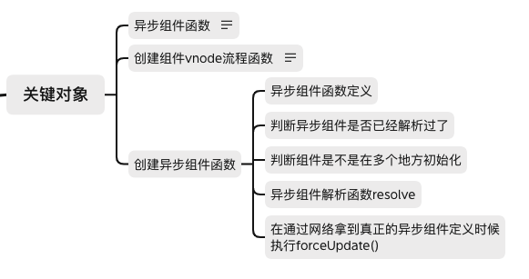

### 异步组件
* 示例
``` js
Vue.component('async-example', function (resolve, reject) {
   // 这个特殊的 require 语法告诉 webpack
   // 自动将编译后的代码分割成不同的块，
   // 这些块将通过 Ajax 请求自动下载。
   require(['./my-async-component'], resolve)
})
Vue.component(
  'async-webpack-example',
  // 该 `import` 函数返回一个 `Promise` 对象。
  () => import('./my-async-component')
)
```
#### 基本概念解析
* 异步组件的形式：为一个函数，如上代码所示，这个时候我们通过是否有cid来区分是组件转对象转化为function还是异步组件定义。
* resolve，reject用来在组件异步加载成功或者失败之后进行导出组件内容。(需要通过once来限定只能导出一次，防止重复导出)。
* once：参数为函数，规定这个函数只能执行一次（闭包来实现）。
* 组件是异步的，因此第一次拿不到定义，需要处理拿到定义之后开始执行。

#### 具体流程代码
1. createComponent创建组件时候，异步组件是一个函数，且没有cid。那么只有cid没有那么我们可以尝试使用resolveAsyncComponent去处理这个函数
```
  function createComponent(Ctor) {
    // ... 省略之前的代码
    // 当cid为undefined则代表为异步组件
    if(Ctor.cid === undefined) {
      Ctor = resolveAsyncComponent(asyncFactory, baseCtor, context)
      if(Ctor === undefined) {
        // 创建一个注释标签。不再继续往下执行。
        return 
      }
    } 
  }
```
2. resolveAsyncComponent来解析异步组件，使用resolve，reject来接收异步请求的结果。
* 考虑多次调用异步组件的情况，这个时候会导致每次都来发请求？给组件定义加一个参数owners，当判断有这个参数代表已经发送请求了，后边的人就不要请求了。
* 当加载成功之后重新渲染组件时候如何返回正确的结果？而不是继续执行。给组件定义加一个参数resolved，当有值的时候代表已经请求成功了，并且赋值为拿到的组件定义，不需要发送请求了直接返回就好
``` js
  function resolveAsyncComponent(factory,baseCtor, context) {
    if (factory.resolved) {
      return factory.resolved
    }
    if (factory.owners && factory.owners.indexOf(context) === -1) {
      factory.owners.push(context)
    }
    if (!factory.resolved && factory.owners = undefined) {
      facotry.owners = [context]
      
    }
  }
```
3. 那么之后我们需要执行异步组件函数了，并且需要接受结果，并且触发用到异步组件的重新渲染。
``` js
  // 触发组件的异步更新
  var forceRender() {
    for (let i = 0; i< factory.owners.length;i++) {
      factory.owners[i].$forceUpdate()
    }
  }
  // 定义接受成功回调函数
  var resolve = once(function(res) {
    // 拿到异步组件中的定义，放到异步组件定义resolved属性上。
    factory.resolved = ensureCtor(res, baseCtor)
    // 触发重新更新
    forceRender()
  })
  var reject = once(function(reason) {
    console.warn(`${String(factory) is failed to resolve async component}`)
  })
```
* 这里这个once的作用是什么呐？我们知道resolve的作用接收异步组件的定义并且触发重新渲染，那么如果他多次执行就会执行多次渲染，因此once是防止resolve多次执行的
``` js
function once(fn) {
  let called = true
  return function(arg) {
    if (!called) {
      called = true
      fn(arg)
    }
  }
}
```
4.resolve的的两个功能值的重新渲染已经好了，还差接收参数了，也就是ensureCtor函数,
* 这里import会主动去发送http请求异步的资源，拿到结果之后返回。参考es6 import
* es6 import() 是异步发起请求，nodejs中的require是同步发送请求
``` js
  ensureCtor(res, context) {
    if (res.__esModule ) {
      res = res.default
    }
    return isObject(res) ? context.extend(res) : res
  }
```
5.那么现在我们执行factory异步组件函数并且将resolve传入即可
``` js
  let result factory(resolve,reject)
  if (ifPromise(result)) {
    result.then(resolve).catch(reject)
  }
```


