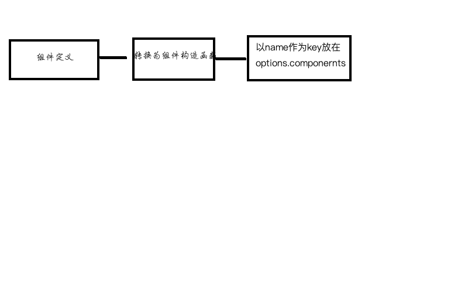

### vue组件的注册逻辑
#### 全局注册
* 通过Vue.component(id, definition)来注册一个全局组件。
``` js
  let assetsType = ['component', 'directive', 'filter']
  assetsType.forEach((key) => {
    Vue[key] = function(id, definition) {
      if (!definition) {
        return this.options[type + 's'][id]
      } else {
        // 如果为component，那么以组件的name或者参数的id作为key,将组件的定义通过Vue.extend转换作为value保存在optons.components中。
        if (type === 'component' && isPlainObject(definition)) {
          definition.name = definition.name || id
          definition = this.options._base.extend(definition)
        }
        // 如果为directive。
        if (type === 'directive' && typeof definition === 'function') {
          definition = { bind: definition, update: definition }
        }
        this.options[type + 's'][id] = definition
        return definition
      }
    }
  })
```

#### 局部注册
* 通过引入组件的定义，然后在components中进行配置，然后再template中我们就可以使用我们注册的组件字符串来进行使用了。
``` js
  export default {
    components: {
      inputList: inputList
    }
  }
```
* 这里vue是怎么实现的呐？在createElement中，我们判断tag是字符串且是一个浏览器保留标签那么会创建普通元素的虚拟dom，如果不是保留标签那么就会认为是一个组件标签。这里就要从options中取。
* 组件的解析，如何找到全局或者局部注册的组件？
``` js
function createElement() {
  if (typeof tag === 'string') {
  let Ctor
  ns = (context.$vnode && context.$vnode.ns) || config.getTagNamespace(tag)
  // html保留标签
  if (config.isReservedTag(tag)) {
    vnode = new VNode(
      config.parsePlatformTagName(tag), data, children,
      undefined, undefined, context
    )
  } else if (isDef(Ctor = resolveAsset(context.$options, 'components', tag))) {
    // component
    vnode = createComponent(Ctor, data, context, children, tag)
  } else {
    vnode = new VNode(
      tag, data, children,
      undefined, undefined, context
    )
  }
  }else {
    vnode = createComponent(tag, data, context, children)
  }
}
```
``` js
// resolveAsset，从context的options中找定义
function resolveAsset (options, type, id) {
  if (hasOwn(assets, id)) return assets[id]
  // 转换为驼峰形式来拿
  const camelizedId = camelize(id)
  if (hasOwn(assets, camelizedId)) return assets[camelizedId]
  // 转换首字母大写来拿去
  const PascalCaseId = capitalize(camelizedId)
  if (hasOwn(assets, PascalCaseId)) return assets[PascalCaseId]
  const res = assets[id] || assets[camelizedId] || assets[PascalCaseId]
  // 拿不到定义报错提示
  if (process.env.NODE_ENV !== 'production' && warnMissing && !res) {
    warn(
      'Failed to resolve ' + type.slice(0, -1) + ': ' + id,
      options
    )
  }
  return res
}
```
