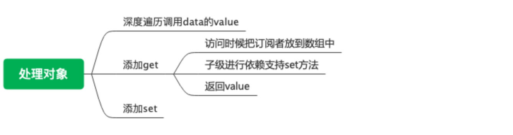

### 响应式说明
### 目标总览

### 问题
1. data中的数据如何防止循环应用和重复遍历？
* 给数据增加处理标记__ob__,然后在处理数据时候进行判断。
2. data中如何处理数组类型的数据的？
* 劫持数组原型中可以更改数据的方法。
3. Vue.set是怎么实现的？
* 拿到target.__ob__.dep,执行dep.depend()
4. data中的数据被defineReactive时候是深度遍历还是广度遍历？
* 深度
### 实际代码
1. 验证data身份是否可以被处理。
* 只有数组或者对象才可被监听。
* 已经监听过得就不要走了。
``` js
  function observe(data) {
    let ob = null
    if (!isObject(data)) {
      return
    }
    if (data.__ob__) {
      ob = data.__ob__
    } else {
      ob = new Observer(data)
    }
    return ob
  }
```
2. 通过Observer为data设置监听
* 设置监听标记
* 设置存储订阅者的变量dep
* 根据data的不同类型进行不同的处理逻辑
``` js
  class Observer() {
    constructor(data) {
      this.value = data
      this.data.__ob__ = this // 监听标记
      this.dep = new Dep() // 存储订阅者的标记
      if (Array.isArray) {
        proment(data)
        observeArray(data)
      } else {
        this.walk(data)
      }
    }
  }
```
3. 处理array类型的数据
* 劫持数组原型上能够改变数组的方法
* 遍历数组进行observe监听

``` js
// 劫持原型上的方法.
function proment(data) {
  let prototypeData = Object.create(Array.prototype);
  let method = ['push', 'pop', 'unshift', 'shift', 'splice', 'sort', 'reverse']
  let inserted = []
  method.forEach((key) => {
    data[key] = function(...arg) {
      let originVal = prototypeData[key].apply(this, arg)
      let ob = data.__ob__
      switch (key) {
        case 'push':
        case 'unshift':
          inserted = arg
          break
        case 'splice':
          inserted = arg.slice(2) 
          breack 
      }
      if (inserted) {
        ob.observeArray(inserted)
      }
      ob.notify() // 触发更新
      return result
    }
  })

}
```
``` js
  // 遍历数组执行observe
  function observeArray(array) {
    array.forEach((item) => {
      observe(array)
    })
  }
```
4. 处理对象数据walk
* 遍历对象key调用defineReactive(data,key,val)

``` js
Observer.prototype.walk = function(data) {
  for (let key in data) {
    let val = data[key]
    defineReactive(data,key,val)
  }
}
function defineReactive(target,key,val) {
  let dep = new Dep()
  let childObj = observe(val)
  Object.defineProperty(target,key, {
    get() {
      if (Dep.target) {
        dep.depend()
        if (childObj) {
          childObj.depend()
          // 兼容Vue.set('obj.arrary[0]', 'test', '111')的情况
          if (Array.isArray(childObj)) {
            dependArray(childObj)
          }
        }
      }
      return val
    }
  })
}
```